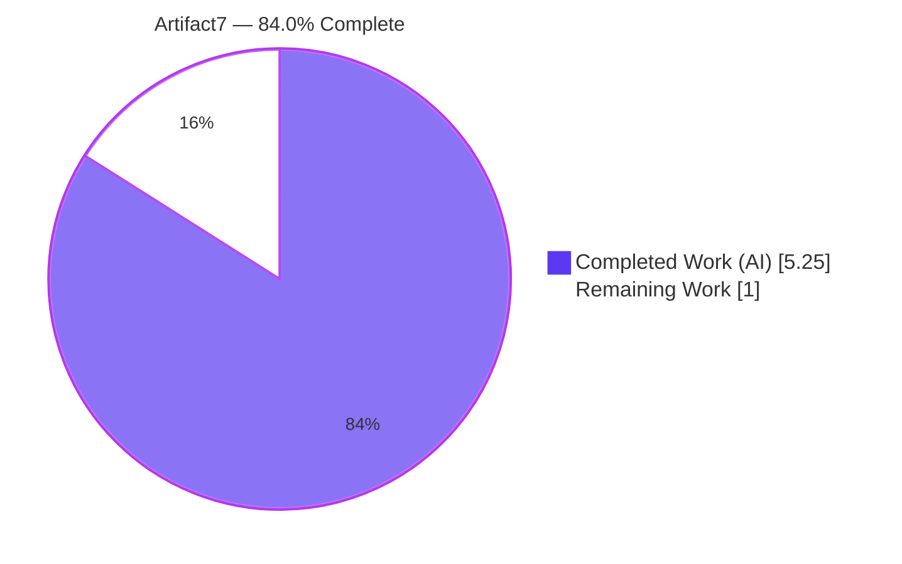
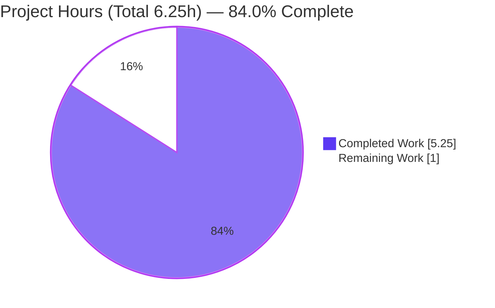
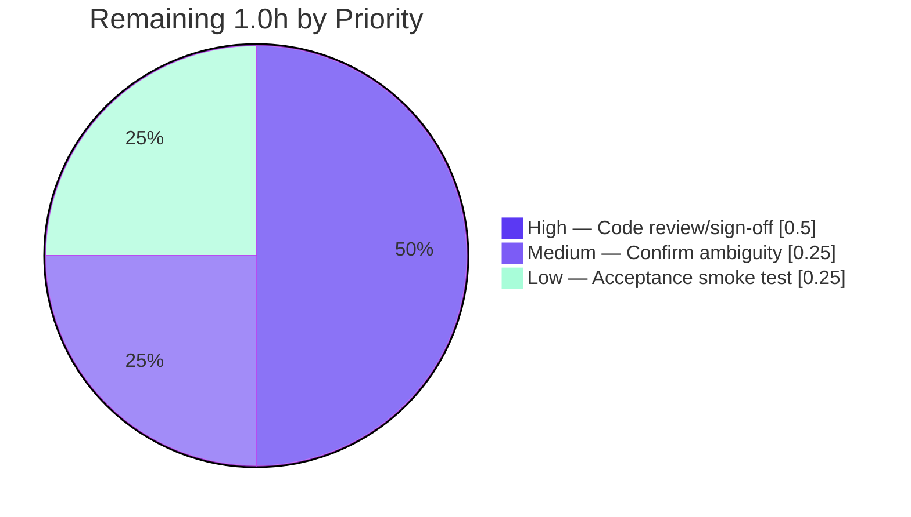

# Blitzy Project Guide — Artifact7

> Minimal Node.js + Express HTTP server exposing two plain-text GET endpoints (`Hello world`, `Good evening`).
> **Status: 84.0% complete** — 5.25h of 6.25h AAP-scoped work delivered autonomously; 1.0h non-blocking human path-to-production work remains.
>
> **Note on figures:** This guide uses **precise** hour values (Completed **5.25h**, Remaining **1.0h**, Total **6.25h**, **84.0%**). The platform dashboard integer fields are rounded approximations of these precise values (5.25→5, 1.0→1); the authoritative completion metric is **84.0%** (= 5.25 ÷ 6.25). Brand colors: Completed = Dark Blue `#5B39F3`, Remaining = White `#FFFFFF`.

---

## 1. Executive Summary

### 1.1 Project Overview

Artifact7 is a tutorial-scale backend HTTP service that realizes the user's request to "add ExpressJS into the project and add another endpoint that returns 'Good evening'." Because the repository was greenfield (only a placeholder `README.md`), the work both establishes a minimal, conventional Express application and adds the requested endpoint. The single Express app serves `GET /` → `Hello world` (baseline, preserved) and `GET /good-evening` → `Good evening` (new), listening on a configurable port (`process.env.PORT || 3000`). The technical scope is intentionally tight: one direct dependency (`express ^5.2.1`), CommonJS modules, plain-text responses, and no out-of-scope tooling. Target users are developers learning Express routing.

### 1.2 Completion Status

**Completion = (Completed Hours ÷ Total Hours) × 100 = 5.25 ÷ 6.25 × 100 = 84.0%**



| Metric | Hours |
|---|---|
| **Total Project Hours** | **6.25** |
| Completed Hours (AI + Manual) | **5.25** |
| &nbsp;&nbsp;• Completed by Blitzy AI | 5.25 |
| &nbsp;&nbsp;• Completed manually | 0.00 |
| **Remaining Hours** | **1.00** |
| **Percent Complete** | **84.0%** |

> Color key — **Completed Work** `#5B39F3` (Dark Blue), **Remaining Work** `#FFFFFF` (White).

### 1.3 Key Accomplishments

- ✅ **Express introduced (R1):** `express ^5.2.1` declared and locked at `5.2.1` (lockfile v3, full 66-package transitive tree); `npm audit` reports 0 vulnerabilities.
- ✅ **New endpoint added (R2):** `GET /good-evening` returns the exact body `Good evening`.
- ✅ **Baseline preserved (R3):** `GET /` returns the exact body `Hello world`, unchanged.
- ✅ **Unified HTTP layer (R4):** both routes registered on one Express `app` (`X-Powered-By: Express` confirmed).
- ✅ **Project scaffolding established:** `package.json` (name, main, `start` script, `engines.node >=18`, ISC license) and `index.js` entry point authored.
- ✅ **Hardened routing:** case-sensitive and strict routing enabled so only the two intended paths match.
- ✅ **Documentation & hygiene:** `README.md` lists endpoints and run steps (title `# Artifact7` retained); `.gitignore` excludes `node_modules/`.
- ✅ **Validated end-to-end:** 13/13 autonomous behavioral + smoke checks pass; `node --check` clean; clean dependency tree.

### 1.4 Critical Unresolved Issues

| Issue | Impact | Owner | ETA |
|---|---|---|---|
| _None — no release-blocking issues identified._ | All AAP requirements implemented, validated, and passing. | — | — |

### 1.5 Access Issues

| System / Resource | Type of Access | Issue Description | Resolution Status | Owner |
|---|---|---|---|---|
| — | — | No access issues identified. Repository, branch, npm registry, and Node/npm toolchain were all accessible during autonomous validation. | N/A | — |

### 1.6 Recommended Next Steps

1. **[High]** Perform human code review of `index.js`, `package.json`, and `README.md`, then sign off for merge.
2. **[Medium]** Confirm the greenfield assumption with the requester: the repo had no pre-existing server, so the `Hello world` baseline was established from scratch. If a prior server exists, re-apply the two routes additively.
3. **[Low]** Run the manual acceptance smoke test (`npm install` → `npm start` → curl both endpoints) in the target environment.
4. **[Low]** (Optional) Decide whether any out-of-scope enhancements (automated tests, security middleware, health checks, deployment artifacts) should be scheduled as follow-up work — none are required by the current AAP.

---

## 2. Project Hours Breakdown

### 2.1 Completed Work Detail

| Component | Hours | Description |
|---|---|---|
| Express dependency introduction (R1 / D1 / D2) | 1.25 | Author `package.json` (express ^5.2.1, main, start script, engines, license); generate `package-lock.json` (lockfile v3) via `npm install`; resolve 66-package tree. |
| Express server & dual-route implementation (R2 / R3 / R4) | 1.25 | Author `index.js`: require Express, construct `app`, register `GET /` → `Hello world` and `GET /good-evening` → `Good evening`, `app.listen(PORT)` with startup log; production-quality inline comments. |
| Routing-strictness QA fix (commit `e07a386`) | 0.50 | Enable case-sensitive + strict routing so only the two intended paths match; re-validate 404 fallthrough behavior. |
| Documentation — README (D3) | 0.50 | Add Endpoints table and Running instructions; retain `# Artifact7` title. |
| Version-control hygiene — .gitignore (D4) | 0.25 | Exclude `node_modules/` from version control. |
| Autonomous validation & QA | 1.50 | 13 behavioral/smoke checks, `node --check`, JSON manifest validation, `npm ls`/`npm audit`, runtime + PORT-override verification, cross-file consistency review. |
| **Total Completed** | **5.25** | |

> Validation: Total of Hours column = **5.25**, matching Completed Hours in Section 1.2.

### 2.2 Remaining Work Detail

| Category | Hours | Priority |
|---|---|---|
| Human code review & merge sign-off (path-to-production) | 0.50 | High |
| Confirm greenfield-vs-existing-product ambiguity with requester (AAP §0.1.1) | 0.25 | Medium |
| Manual acceptance smoke test in target environment | 0.25 | Low |
| **Total Remaining** | **1.00** | |

> Validation: Total of Hours column = **1.00**, matching Remaining Hours in Section 1.2 and the Section 7 pie chart "Remaining Work" value.

### 2.3 Out-of-Scope Enhancements (Excluded from Totals)

The following are **explicitly out of scope** per AAP §0.3.2 and are **NOT** counted in the 6.25h total or the completion percentage. They are listed only as optional future considerations, should the project's scope expand beyond the current tutorial intent.

| Enhancement | Indicative Effort | Notes |
|---|---|---|
| E-1 Automated test suite (Jest/Mocha + supertest) | ~2–3h | Tests are out-of-scope (AAP §0.3.2); behavior was validated via temporary harnesses only. |
| E-2 Security hardening (helmet, rate-limiting, disable `X-Powered-By`) | ~2–4h | No security middleware requested. |
| E-3 `/health` endpoint + structured logging | ~2–3h | No monitoring/observability requested. |
| E-4 Deployment artifacts (Dockerfile, CI/CD, IaC) | ~4–8h | No CI/CD or containerization requested. |
| E-5 Graceful shutdown + `listen` error handling | ~1–2h | No production hardening requested. |

---

## 3. Test Results

All tests below originate from **Blitzy's autonomous validation logs** for this project. Test suites are out-of-scope as a committed deliverable (AAP §0.3.2), so validation was performed with **temporary black-box harnesses** (spawning the real server via `node index.js` and issuing live HTTP requests); these harnesses were kept in `/tmp` and never committed.

| Test Category | Framework | Total Tests | Passed | Failed | Coverage % | Notes |
|---|---|---|---|---|---|---|
| Behavioral (black-box HTTP) | Node.js + live HTTP harness | 10 | 10 | 0 | N/A (black-box) | Startup log, PORT override, `GET /` 200 + exact body, `GET /good-evening` 200 + exact body, 404 fallthrough, case-sensitive 404, strict-routing 404, `Content-Type` check. |
| Final smoke (post-validation) | `node index.js` + curl | 3 | 3 | 0 | N/A (black-box) | `GET /` → Hello world; `GET /good-evening` → Good evening; `GET /nope` → 404 (run on PORT=4321). |
| **Total** | | **13** | **13** | **0** | **100% pass** | Zero failures, zero skipped, zero blocked. |

**Functional coverage achieved:** both routes (exact bodies), 404 fallthrough for unmatched paths, case-sensitive routing, strict (trailing-slash) routing, and PORT override. Line/branch coverage instrumentation is **N/A** for black-box validation. Static check `node --check index.js` passed; `package.json` and `package-lock.json` are valid JSON; `npm audit` found **0 vulnerabilities**.

---

## 4. Runtime Validation & UI Verification

**Runtime health (validated via autonomous logs and independent re-run):**

- ✅ **Operational** — `npm start` runs `node index.js` and logs `Server listening on port 3000`.
- ✅ **Operational** — `GET /` → `200 OK`, body `Hello world`, `Content-Type: text/html; charset=utf-8`, `Content-Length: 11`.
- ✅ **Operational** — `GET /good-evening` → `200 OK`, body `Good evening`, `Content-Length: 12`.
- ✅ **Operational** — `GET /<unmatched>` → `404 Not Found` (Express default fallthrough).
- ✅ **Operational** — Case-sensitive routing: `GET /GOOD-EVENING` → `404`.
- ✅ **Operational** — Strict routing: `GET /good-evening/` → `404`.
- ✅ **Operational** — Unified Express layer confirmed via `X-Powered-By: Express` response header (R4).
- ✅ **Operational** — PORT override (`PORT=4010 npm start` / `PORT=8080 npm start`) honored; server binds the supplied port (twelve-factor, AAP §0.5.6).

**API integration outcomes:** No external/third-party integrations exist in scope; nothing to integrate or mock.

**UI verification:** ⚠ **Not applicable.** This is a backend HTTP service returning plain text; there is no graphical user interface, component library, or design system (AAP §0.5.4). No Figma frames were provided (AAP §0.9.2).

---

## 5. Compliance & Quality Review

Cross-mapping of AAP deliverables and rules to quality/compliance benchmarks. Fixes applied during autonomous validation are noted; there are no outstanding items.

| # | AAP Item / Benchmark | Requirement | Status | Evidence / Notes |
|---|---|---|---|---|
| R1 | Introduce Express | Express declared, installed, locked | ✅ Pass | `package.json` express ^5.2.1; `package-lock.json` v3 pins 5.2.1; `npm ls` clean. |
| R2 | Add `Good evening` endpoint | `GET /good-evening` → `Good evening` | ✅ Pass | `index.js` route; body byte-exact in tests. |
| R3 | Preserve `Hello world` | `GET /` → `Hello world` unchanged | ✅ Pass | `index.js` route; body byte-exact in tests. |
| R4 | Unified Express HTTP layer | Both routes on one `app` | ✅ Pass | Single `app`; `X-Powered-By: Express`. |
| D1 | `package.json` | Manifest with main, start, deps | ✅ Pass | name artifact7, main index.js, start "node index.js", engines node>=18, license ISC. |
| D2 | `package-lock.json` | Reproducible lockfile | ✅ Pass | lockfileVersion 3; full transitive tree. |
| D3 | `README.md` | Endpoints + run docs; title retained | ✅ Pass | "# Artifact7" retained; Endpoints table + Running section. |
| D4 | `.gitignore` | Exclude `node_modules/` | ✅ Pass | Single `node_modules/` entry. |
| C1 | Exact response strings | `Hello world` / `Good evening` | ✅ Pass | Verbatim in handlers and tests. |
| C2 | Minimal-changes rule (§0.7.1) | Only in-scope files; no opportunistic refactor | ✅ Pass | Exactly the 5 enumerated files exist; no extra routes/middleware/tooling. |
| C3 | CommonJS module system | `require`, no `"type":"module"` | ✅ Pass | `const express = require('express')`. |
| C4 | Runtime floor Node ≥ 18 | Express 5 floor honored | ✅ Pass | `engines.node ">=18"`; validated on Node 20.x. |
| C5 | Zero Placeholder Policy | No TODO/FIXME/stubs | ✅ Pass | None present in `index.js`. |
| Q1 | Static / dependency health | Compiles; no vulns | ✅ Pass | `node --check` exit 0; `npm audit` 0 vulnerabilities. |

**Fixes applied during autonomous validation:** Routing strictness (case-sensitive + strict) was enforced (commit `e07a386`) to ensure only the two intended paths match. **Outstanding items:** none.

---

## 6. Risk Assessment

| # | Risk | Category | Severity | Probability | Mitigation | Status |
|---|---|---|---|---|---|---|
| 1 | Greenfield-vs-"existing product" ambiguity — baseline server was established from scratch because none existed in the repo | Technical / Requirements | Medium | Medium | Confirm with requester (HT-2); if a prior server exists, apply the two routes additively | **Open** |
| 2 | No committed automated test suite | Technical | Low | Low | Behavior validated via temporary black-box harnesses (13/13); tests out-of-scope per AAP §0.3.2 | Accepted (out of scope) |
| 3 | No crash/restart or graceful-shutdown handling | Operational | Low | Low | Acceptable for tutorial scope; see E-5 if scope expands | Accepted (out of scope) |
| 4 | `X-Powered-By: Express` header exposed | Security | Low | Low | Disable via `app.disable('x-powered-by')` only if hardening is later requested (E-2) | Accepted (out of scope) |
| 5 | No security middleware / TLS (helmet, rate-limit) | Security | Low | Low | Not requested; add in E-2 if productionizing | Accepted (out of scope) |
| 6 | No health-check / monitoring / structured logging | Operational | Low | Low | Not requested; add in E-3 if productionizing | Accepted (out of scope) |
| 7 | `express ^5.2.1` caret range could resolve to newer 5.x | Technical / Dependency | Low | Low | `package-lock.json` pins exact resolved versions for reproducible installs | Mitigated |
| 8 | Host must provide Node.js ≥ 18 | Integration | Low | Low | `engines.node ">=18"` declared; validated on Node 20.x | Mitigated |

**Net risk profile: LOW.** The only **Open** item is a non-blocking requirements clarification (Risk #1 → HT-2). All remaining items are deliberate out-of-scope decisions or already mitigated — none are defects.

---

## 7. Visual Project Status

**Project hours — Completed vs Remaining** (Completed `#5B39F3`, Remaining `#FFFFFF`):



**Remaining work by priority** (sums to the 1.0h Remaining):



| Priority | Remaining Hours |
|---|---|
| High | 0.50 |
| Medium | 0.25 |
| Low | 0.25 |
| **Total** | **1.00** |

> Integrity: "Remaining Work" = **1.0h** here equals Section 1.2 Remaining Hours and the Section 2.2 Hours total. "Completed Work" = **5.25h** equals Section 1.2 Completed Hours and the Section 2.1 total.

---

## 8. Summary & Recommendations

**Achievements.** The project is **84.0% complete** (5.25h of 6.25h AAP-scoped work delivered autonomously). All four explicit/implicit requirements are implemented and validated: Express is introduced as the sole direct dependency (R1), `GET /good-evening` → `Good evening` is added (R2), the `GET /` → `Hello world` baseline is preserved (R3), and both routes are served through a single Express application (R4). Supporting deliverables (`package.json`, `package-lock.json`, `README.md`, `.gitignore`) are complete, and routing was hardened to expose exactly the two intended paths. Autonomous validation passed at 13/13 with 0 vulnerabilities.

**Remaining gaps (1.0h, non-blocking).** What remains is standard path-to-production human activity rather than engineering work: code review and merge sign-off (0.5h, High), confirmation of the greenfield assumption with the requester (0.25h, Medium), and a manual acceptance smoke test in the target environment (0.25h, Low).

**Critical path to production.** Human code review → confirm greenfield assumption → acceptance smoke test → merge. No defects block this path.

**Production readiness assessment.** For the **stated tutorial scope**, the codebase is production-ready: it installs cleanly, compiles, passes all behavioral checks, and runs via `npm start`. If the scope later expands toward a hardened production service, consider the out-of-scope enhancements in Section 2.3 (tests, security middleware, health checks, deployment artifacts) — all explicitly excluded from the current AAP and therefore from the 6.25h total.

| Success Metric | Target | Actual |
|---|---|---|
| AAP requirements implemented | R1–R4 | ✅ 4 / 4 |
| Autonomous tests passing | 100% | ✅ 13 / 13 |
| Dependency vulnerabilities | 0 | ✅ 0 |
| Completion (AAP-scoped) | — | **84.0%** |

---

## 9. Development Guide

### 9.1 System Prerequisites

- **Node.js ≥ 18** (Express 5 floor; validated on Node 20.x). Verify: `node -v`
- **npm** (ships with Node; validated with npm 11.x). Verify: `npm -v`
- **OS:** any Node-supported platform (Linux/macOS/Windows). **Hardware:** negligible (tutorial-scale).

### 9.2 Environment Setup

No environment file is required. The only configurable value is the listening port via the optional `PORT` variable (defaults to `3000`):

```bash
# optional — override the default port
export PORT=3000
```

### 9.3 Dependency Installation

Run from the repository root (the directory containing `package.json`):

```bash
npm install
```

Expected output (abridged): installs `express@5.2.1` and its transitive tree, ending with `found 0 vulnerabilities`.

### 9.4 Application Startup

```bash
npm start          # equivalent to: node index.js
```

Expected log line:

```
Server listening on port 3000
```

To run on a different port:

```bash
PORT=8080 npm start    # logs: Server listening on port 8080
```

### 9.5 Verification Steps

With the server running, in a second terminal:

```bash
curl http://localhost:3000/              # -> Hello world
curl http://localhost:3000/good-evening  # -> Good evening
curl -i http://localhost:3000/missing    # -> HTTP/1.1 404 Not Found
```

Inspect headers for the baseline route:

```bash
curl -i http://localhost:3000/
# HTTP/1.1 200 OK
# X-Powered-By: Express
# Content-Type: text/html; charset=utf-8
# Content-Length: 11
```

Static sanity check (no server needed):

```bash
node --check index.js   # exit 0 = syntax OK
```

### 9.6 Example Usage

```bash
# Terminal 1
npm start

# Terminal 2
$ curl http://localhost:3000/
Hello world
$ curl http://localhost:3000/good-evening
Good evening
```

### 9.7 Troubleshooting

- **`EADDRINUSE` (port already in use):** another process holds the port. Start on a free port: `PORT=8080 npm start`, or stop the conflicting process.
- **`Error: Cannot find module 'express'`:** dependencies not installed. Run `npm install` from the repo root, then retry.
- **Unexpected Node behavior / syntax errors:** confirm Node ≥ 18 with `node -v`; upgrade if older.
- **Commands appear to do nothing / file not found:** ensure you are in the repository root (the folder containing `package.json` and `index.js`).
- **404 for `/GOOD-EVENING` or `/good-evening/`:** expected — routing is case-sensitive and strict; use the exact lowercase path `/good-evening` with no trailing slash.

---

## 10. Appendices

### A. Command Reference

| Command | Purpose |
|---|---|
| `npm install` | Install Express and its transitive dependencies; generate/refresh `package-lock.json`. |
| `npm start` | Start the server (`node index.js`). |
| `node index.js` | Start the server directly. |
| `PORT=8080 npm start` | Start on a custom port. |
| `node --check index.js` | Validate JS syntax without executing. |
| `npm ls` | Show the resolved dependency tree. |
| `npm audit` | Report dependency vulnerabilities. |
| `curl http://localhost:3000/` | Smoke-test the baseline endpoint. |
| `curl http://localhost:3000/good-evening` | Smoke-test the new endpoint. |

### B. Port Reference

| Port | Role | Configurable |
|---|---|---|
| `3000` | Default HTTP listen port | Yes — via `PORT` env var (`process.env.PORT || 3000`). |

### C. Key File Locations

| File | Role |
|---|---|
| `index.js` | Express entry point; declares `app`, the two GET routes, and `app.listen`. |
| `package.json` | Manifest: `main`, `start` script, `engines.node`, `dependencies.express`, ISC license. |
| `package-lock.json` | Lockfile (v3); pins Express 5.2.1 and the full transitive tree. |
| `README.md` | Project title (`# Artifact7`), endpoints table, run instructions. |
| `.gitignore` | Excludes `node_modules/`. |
| `node_modules/` | Installed dependencies (generated; git-ignored, not committed). |

### D. Technology Versions

| Component | Version |
|---|---|
| express | ^5.2.1 (resolved/locked 5.2.1) |
| Node.js | ≥ 18 required (validated on Node 20.x) |
| npm | 11.x (validated) |
| package-lock format | lockfileVersion 3 |
| Module system | CommonJS |
| License | ISC |

### E. Environment Variable Reference

| Variable | Required | Default | Purpose |
|---|---|---|---|
| `PORT` | No | `3000` | HTTP listening port (twelve-factor override). |

### F. Developer Tools Guide

| Tool | Use |
|---|---|
| `node --check <file>` | Syntax validation without execution. |
| `curl` / `curl -i` | Exercise endpoints; inspect status and headers. |
| `npm ls` / `npm audit` | Inspect dependency tree and security posture. |
| `git log --oneline` | Review the commit history of the change. |

### G. Glossary

| Term | Definition |
|---|---|
| AAP | Agent Action Plan — the authoritative spec governing this change. |
| Greenfield | A project started from scratch with no pre-existing implementation. |
| CommonJS | Node's `require`-based module system (no `"type":"module"`). |
| Lockfile | `package-lock.json`; pins exact dependency versions for reproducible installs. |
| Strict routing | Express setting where `/path` and `/path/` are treated as distinct. |
| Path-to-production | Standard activities (review, sign-off, acceptance) to deploy delivered work. |

---

*Completion is measured strictly against AAP-scoped work plus path-to-production activities: **5.25h completed ÷ 6.25h total = 84.0% complete**, with **1.0h** of non-blocking human work remaining. Brand colors applied throughout: Completed `#5B39F3`, Remaining `#FFFFFF`.*